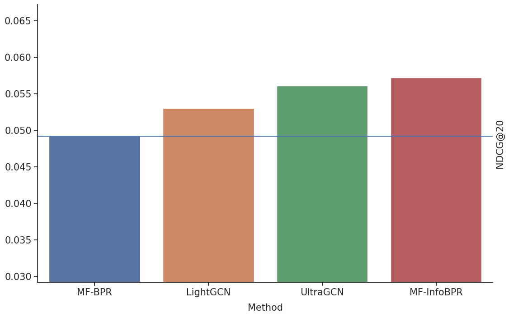
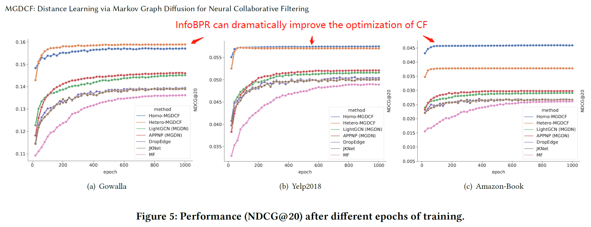

# InfoBPR
Simple Yet Powerful Ranking Loss

We provide InfoBPR API for both TensorFlow and PyTorch.


__Paper:__ [MGDCF: Distance Learning via Markov Graph Diffusion for Neural Collaborative Filtering](https://arxiv.org/abs/2204.02338)

## Homepage and Paper

+ Homepage (MGDCF): [https://github.com/hujunxianligong/MGDCF](https://github.com/hujunxianligong/MGDCF)
+ Homepage (InfoBPR Loss): [https://github.com/CrawlScript/InfoBPR](https://github.com/CrawlScript/InfoBPR)
+ Paper: [MGDCF: Distance Learning via Markov Graph Diffusion for Neural Collaborative Filtering](https://arxiv.org/abs/2204.02338) 


## Performance

MF (Matrix Factorization) can beat state-of-the-art GNN-based CF approaches with our InfoBPR Loss (MF-InfoBPR).


<p align="center">

<p align="center">NDCG@20 of different approaches on Yelp2018</p>
</p>


InfoBPR also can improve the optimization of CF models.

<p align="center">

</p>

## Installation


```bash
pip install info_bpr
```

Note that the installed info_bpr library support both TensorFlow and PyTorch.


## Usage

For PyTorch users:

```python
# coding=utf-8
import os
import torch
from info_bpr.losses import th_info_bpr as info_bpr

os.environ["CUDA_VISIBLE_DEVICES"] = "0"

num_users = 5
num_items = 5
embedding_size = 64
user_embeddings = torch.randn(num_users, embedding_size).cuda()
item_embeddings = torch.randn(num_items, embedding_size).cuda()
user_item_edges = [
    [0, 1],
    [0, 2],
    [2, 4],
    [3, 4]
]

ranking_loss = info_bpr(user_embeddings, item_embeddings, user_item_edges, num_negs=300)
print("InfoBPR Loss: ", ranking_loss)
```


## DEMO

[Matrix Factorization with InfoBPR Loss (MF-InfoBPR)](demo/demo_torch_mf_info_bpr.py)


## Cite

If you use InfoBPR in a scientific publication, we would appreciate citations to the following paper:

@misc{https://doi.org/10.48550/arxiv.2204.02338,
  doi = {10.48550/ARXIV.2204.02338},
  
  url = {https://arxiv.org/abs/2204.02338},
  
  author = {Hu, Jun and Qian, Shengsheng and Fang, Quan and Xu, Changsheng},
  
  keywords = {Social and Information Networks (cs.SI), Machine Learning (cs.LG), FOS: Computer and information sciences, FOS: Computer and information sciences},
  
  title = {MGDCF: Distance Learning via Markov Graph Diffusion for Neural Collaborative Filtering},
  
  publisher = {arXiv},
  
  year = {2022},
  
  copyright = {arXiv.org perpetual, non-exclusive license}
}

